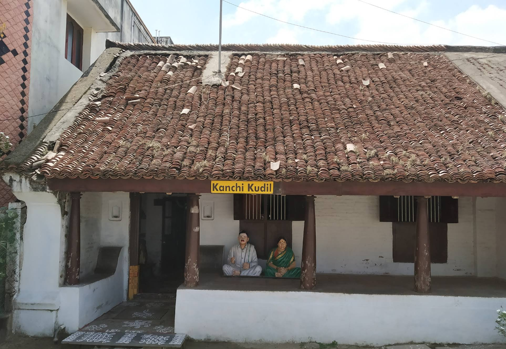

# Ex04 Places Around Me
# Date:14/04/2025
# AIM
To develop a website to display details about the places around my house.

# DESIGN STEPS
## STEP 1
Create a Django admin interface.

## STEP 2
Download your city map from Google.

## STEP 3
Using <map> tag name the map.

## STEP 4
Create clickable regions in the image using <area> tag.

## STEP 5
Write HTML programs for all the regions identified.

## STEP 6
Execute the programs and publish them.

# CODE
'''
map.html

<html>
    <head>
        <title>My City</title>
    </head>
    <body>
        <h1 align="center">
            <b>Kanchipuram</b>
        </h1>
        <h3 align=center>
            <b>Keerthana R (212224040156)</b>
        </h3>
        

            
            <map name="MyCity">
               

    <area target="" alt="Hotel Ramco Residency" title="Hotel Ramco Residency,Kanchipuram" href="ramco.html" coords="816,153,1091,221" shape="rect">
    <area target="" alt="Kamakshi Temple" title="Kamakshi Temple" href="temple.html" coords="893,220,1198,260" shape="rect">
    <area target="" alt="Kanchi Kudil" title="Kanchi Kudil" href="kudil.html" coords="437,628,749,709" shape="rect">
    <area target="" alt="Damro Furniture" title="Damro Furniture" href="damro.html" coords="891,412,1218,463" shape="rect">
                
            </map>
        

    </body>
</html>

temple.html

<html>
    <head>
        <title>
            My Home Town
        </title>
    </head>
    <body bgcolor="pink"
<h1 align="center">
    <b>Kanchipuram</b>
</h1>
<h3 align="center">
    <b>Kamakshi Amman Temple</b>
</h3>

    
        The temple's main diety is goddess Parvathi.This temple is famous for tourist spot.
    

</body>
</html>

kudil.html

<html>
    <head>
        <title>My City</title>
    </head>
    <body bgclor="purple">
        <h1 align="center">
            <b>Kanchipuram</b>
        </h1>
        <h3 align="center">
            <b>Kanchi Kudil</b>
        </h3>
        

        

            
                Kanchi Kudil is an ancestoral house. There we can see lots of antique things. They still maintain the traditional culture.
            
        

    </body>
</html>

damro.html

<html>
    <head>
        <title>My Home Town</title>
    </head>
    <body bgcolor="green">
        <h1 align="center">
            <b>Kanchipuram</b>
        </h1>
        <h3 align="center">
            <b>Damro Furniture</b>
        </h3>
        

        

            
                Damro furniture is one of the famous furniture shops in kanchipuram.
            
        

    </body>
</html>

ramco.html

<html>
    <head>
        <body bgcolor="red">
            <h1 align="center">
                <b>Kanchipuram</b>
            </h1>
            <h3 align="center">
                <b>Ramco Residency</b>
            </h3>
            

            

                
                    Ramco Residency which is located in Kanchipuram is a residency lodge for touristers and outer area people.
                
            

        </body>
    </head>
</html>

'''
# OUTPUT

# RESULT
The program for implementing image maps using HTML is executed successfully.
